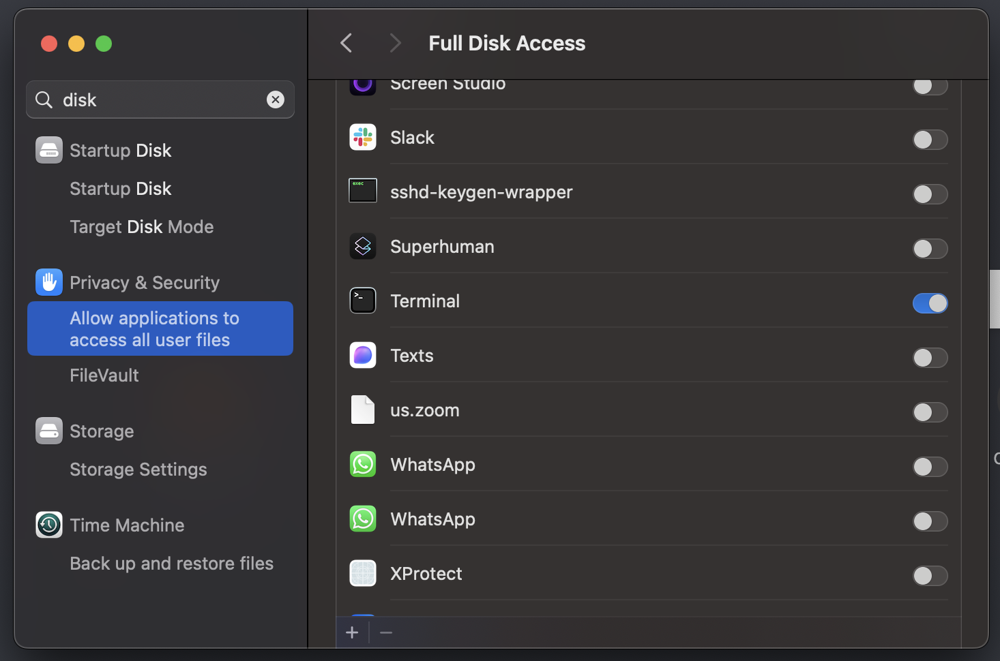

# Chat Apple Notes


A CLI application implementing RAG (Retrieval Augmented Generation) and semantic search for Apple Notes using OpenAI's Assistants API. The tool vectorizes your notes into embeddings, enabling natural language querying through OpenAI's vector store.

## Key Features

- **Vector Store Integration**: Extracts Apple Notes via AppleScript and creates embeddings using OpenAI's vector store
- **Semantic Search**: Queries note embeddings to find contextually relevant matches
- **RAG-based Queries**: Leverages note embeddings for context-aware question answering
- **Conversational Interface**: Maintains chat context through OpenAI's thread management

## Installation

Requirements:
- Python 3.7+
- macOS (for Apple Notes access)
- OpenAI API key

```bash
# Clone repository
git clone https://github.com/yashgoenka/chat-apple-notes
cd chat-apple-notes

# Install dependencies
pip install -r requirements.txt

# Launch CLI
python chat_apple_notes.py
```

## Terminal Disk Access Setup

Before using the application, you'll need to grant Full Disk Access to Terminal (or your preferred terminal emulator) in macOS System Settings. This is required for the application to access your Apple Notes.

1. Open System Settings
2. Navigate to Privacy & Security > Full Disk Access
3. Ensure the toggle next to Terminal is enabled




## Command Reference

### `upload`
Extracts notes via AppleScript, vectorizes content, and uploads to OpenAI's vector store. Tracks changes through content hashing to avoid duplicate uploads.

### `search <query>`
Performs semantic search across vectorized notes using cosine similarity. Returns contextually relevant matches with clickable note links (requires disk access privileges).

### `ask <question>`
Executes RAG using the vector store as context to generate answers grounded in your notes' content.

### `chat`
Initiates a stateful conversation, maintaining context through OpenAI's thread management. The assistant references relevant notes during the conversation.

### `update-api`
Updates stored OpenAI API key.

### `update-privileges`
Toggles disk access for clickable note links. Required for initial upload and hyperlink functionality.


## Getting Started

The recommended way to begin is by entering the CLI interface:

```bash
python chat_apple_notes.py
#greeted with welcome message and instructions
#enter api key
command: upload
#upload complete
command: search "query string"
#search complete
command: ask "specific question"
#ask complete
command: chat
#chat complete
```

Alternatively, you can execute commands directly from the terminal:

```bash
# Semantic search across notes
python chat_apple_notes.py search "query string"

# RAG-based question answering
python chat_apple_notes.py ask "specific question"

# Interactive chat session with context
python chat_apple_notes.py chat
```

## Note: The initial upload process occurs in two phases:

1. **Note Extraction & Parsing** (5-15 minutes)
   - AppleScript extracts all notes and metadata
   - Content is parsed and hashed locally
   - Progress bar shows notes processed

2. **Vectorization & Upload** (10 minutes - 2 hours)
   - Notes are batched for embedding generation
   - Vectors uploaded to OpenAI's store
   - Rate limited by OpenAI's API quotas
   - Progress bar shows upload status

The duration depends on:
- Total number of notes
- Average note length
- OpenAI API rate limits
- System performance

This is a one-time setup process. Subsequent uploads/updates will only process new or modified notes based on content hashing.

## Implementation Details

- Uses AppleScript for native Notes.app interaction
- Implements SHA-256 content hashing for change detection
- Leverages OpenAI's Assistant API with GPT-4 for RAG capabilities
- Manages conversation state through OpenAI's thread system
- SQLite integration for note identifier resolution

## Technical Architecture

```
AppleScript Extraction -> SQLite ID Mapping -> Vector Store Embedding -> GPT-4o Assistant
```

1. **Note Extraction**: 
   - Uses AppleScript to batch extract notes including metadata
   - Maps internal CoreData IDs to external identifiers via SQLite queries
   - Maintains content hash registry to track changes

2. **Vector Store Integration**:
   - Embeds note content using OpenAI's text-embedding model
   - Stores embeddings in OpenAI's Vector Store for efficient similarity search
   - Implements incremental updates based on content hashing

3. **Query Processing**:
   - Performs semantic search using embedded vectors
   - Retrieves relevant note segments as context
   - Augments GPT-4o prompts with retrieved context

## Privacy Considerations

- Notes are processed locally before vectorization
- Content is sent to OpenAI for embedding generation and RAG
- API keys stored locally in `~/chat_apple_notes_config.json`
- Optional disk access required for hyperlink functionality

## Limitations

- Requires macOS and Apple Notes.app
- Terminal needs disk access for note hyperlinking
- Rate limited by OpenAI API quotas
- Limited to text content (no media handling)

## License

MIT License. See [LICENSE](LICENSE) for details.

## Contributing

Contributions welcome! Please feel free to submit a Pull Request.

## Disclaimer

Independent project, not affiliated with Apple or OpenAI. Use within Apple's & OpenAI's terms of service.